# Cloud Architecture Documentation

## Overview

This document provides detailed architecture diagrams and explanations for the self-hosted DevOps runner infrastructure deployed on Azure and AWS. The architecture is designed for **cost optimization, high availability, security, and multi-cloud consistency**.

## Table of Contents

- [High-Level Architecture](#high-level-architecture)
- [Azure Implementation (VMSS)](#azure-implementation-vmss)
- [AWS Implementation (ASG)](#aws-implementation-asg)
- [Network Architecture](#network-architecture)
- [Autoscaling Mechanism](#autoscaling-mechanism)
- [Runner Lifecycle](#runner-lifecycle)
- [Security Architecture](#security-architecture)
- [Spot Instance Management](#spot-instance-management)
- [Multi-Cloud Comparison](#multi-cloud-comparison)
- [Cost Optimization Features](#cost-optimization-features)

---

## High-Level Architecture

### Conceptual Overview

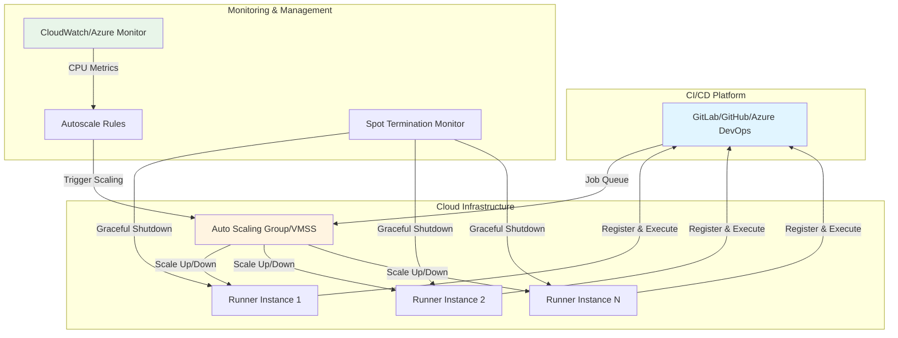

### Key Components

1. **CI/CD Platform**: Source of build jobs (GitLab, GitHub Actions, Azure DevOps)
2. **Auto Scaling Infrastructure**: Dynamic compute resources (AWS ASG or Azure VMSS)
3. **Runner Instances**: Ephemeral VMs/instances executing CI/CD jobs
4. **Monitoring**: Metrics collection and alerting (CloudWatch, Azure Monitor)
5. **Autoscale Rules**: CPU-based scaling policies (scale 0-N based on demand)
6. **Spot Termination Monitoring**: Graceful shutdown handlers for cost-optimized instances

---

## Azure Implementation (VMSS)

### Azure Architecture Diagram

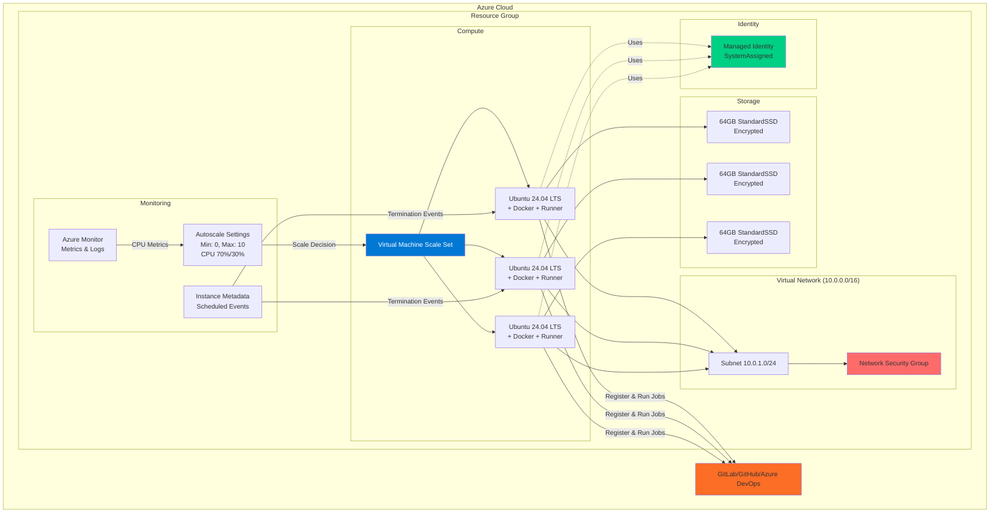

### Azure Components

#### Virtual Machine Scale Set (VMSS)
- **Purpose**: Autoscaling group of identical VMs
- **Configuration**:
  - Spot instances enabled by default (60-90% cost savings)
  - Flexible orchestration mode
  - Availability zones: 1, 2, 3 (high availability)
  - Scale: 0-N instances (cost optimization)

#### Networking
- **VNet**: Configurable CIDR (default: 10.0.0.0/16)
- **Subnet**: Runner subnet (default: 10.0.1.0/24)
- **NSG Rules**:
  - ❌ Inbound: Deny all (SSH disabled by default)
  - ✅ Outbound: Allow internet (required for CI/CD)

#### Storage
- **OS Disk**: 64GB StandardSSD_LRS (default, cost-optimized)
- **Encryption**: Platform-managed keys (enabled)
- **Caching**: ReadWrite for better performance

#### Monitoring
- **Azure Monitor**: CPU, memory, disk, network metrics
- **Autoscale Rules**:
  - Scale out: CPU > 70% for 5 minutes → Add 1 instance
  - Scale in: CPU < 30% for 10 minutes → Remove 1 instance
  - Cooldown: 3 minutes (scale out), 5 minutes (scale in)
- **Scheduled Events**: IMDS monitoring for spot termination

#### Identity & Access
- **Managed Identity**: System-assigned, no credentials stored
- **RBAC**: Minimal permissions (read metadata, write logs)

---

## AWS Implementation (ASG)

### AWS Architecture Diagram

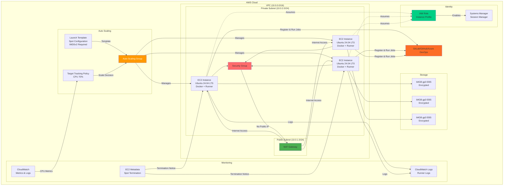

### AWS Components

#### Auto Scaling Group (ASG)
- **Purpose**: Autoscaling group of EC2 instances
- **Configuration**:
  - Spot instances enabled by default (60-90% cost savings)
  - Mixed instances policy for spot diversification
  - Availability zones: Multi-AZ (a, b, c)
  - Scale: 0-N instances (cost optimization)

#### Launch Template
- **Instance Type**: t3.medium (default, 2 vCPU, 4GB RAM)
- **AMI**: Ubuntu 24.04 LTS (latest)
- **User Data**: Runner installation and configuration script
- **Spot Configuration**: Max price, interruption behavior
- **IMDSv2**: Required (security best practice)

#### Networking
- **VPC**: Configurable CIDR (default: 10.0.0.0/16)
- **Private Subnet**: Runner instances (default: 10.0.2.0/24)
- **Public Subnet**: NAT Gateway (internet access)
- **Security Group Rules**:
  - ❌ Inbound: Deny all (SSH disabled by default)
  - ✅ Outbound: Allow all (0.0.0.0/0 for CI/CD operations)
- **No Public IPs**: Instances in private subnet, internet via NAT

#### Storage
- **EBS Volume**: 64GB gp3 (default, cost-optimized)
- **Encryption**: AWS-managed KMS keys (enabled)
- **IOPS**: 3000 baseline (gp3)
- **Throughput**: 125 MiB/s baseline

#### Monitoring & Autoscaling
- **CloudWatch Metrics**: CPU, network, disk, custom metrics
- **Target Tracking Policy**:
  - Target: 70% average CPU utilization
  - Scale out: When CPU > 70% for 2 data points (2 minutes)
  - Scale in: When CPU < 70% for 15 consecutive periods (15 minutes)
- **CloudWatch Logs**: Runner initialization and execution logs
- **Spot Termination**: 2-minute warning via EC2 metadata

#### Identity & Access
- **IAM Role**: Instance profile with minimal permissions
- **Policies**:
  - `AmazonSSMManagedInstanceCore` (Systems Manager access)
  - `CloudWatchAgentServerPolicy` (logging)
- **Session Manager**: SSH alternative (no keys required)

---

## Network Architecture

### Network Topology Comparison

```mermaid
graph TB
    subgraph "Azure Network Topology"
        subgraph "VNet (10.0.0.0/16)"
            AZ_SUBNET[Subnet 10.0.1.0/24]
            AZ_NSG[Network Security Group]
            AZ_VM1[VMSS Instance 1]
            AZ_VM2[VMSS Instance 2]
        end
        AZ_INTERNET[Internet]
    end
    
    subgraph "AWS Network Topology"
        subgraph "VPC (10.0.0.0/16)"
            subgraph "Public Subnet (10.0.1.0/24)"
                AWS_NAT[NAT Gateway]
                AWS_IGW[Internet Gateway]
            end
            subgraph "Private Subnet (10.0.2.0/24)"
                AWS_SG[Security Group]
                AWS_EC2_1[ASG Instance 1]
                AWS_EC2_2[ASG Instance 2]
            end
        end
        AWS_INTERNET[Internet]
    end
    
    AZ_VM1 --> AZ_SUBNET
    AZ_VM2 --> AZ_SUBNET
    AZ_SUBNET --> AZ_NSG
    AZ_NSG -->|Outbound Rules| AZ_INTERNET
    
    AWS_EC2_1 --> AWS_SG
    AWS_EC2_2 --> AWS_SG
    AWS_SG -->|Private Subnet| AWS_NAT
    AWS_NAT -->|Public Subnet| AWS_IGW
    AWS_IGW --> AWS_INTERNET
    
    style AZ_NSG fill:#ff6b6b
    style AWS_SG fill:#ff6b6b
    style AWS_NAT fill:#4caf50
    style AZ_INTERNET fill:#e1f5ff
    style AWS_INTERNET fill:#e1f5ff
```

### Network Security

#### Default Security Posture
| Feature | Azure | AWS | Rationale |
|---------|-------|-----|-----------|
| **SSH Access** | ❌ Disabled | ❌ Disabled | Reduces attack surface |
| **Public IP** | ✅ Required* | ❌ Not assigned | *Azure VMSS requires for internet unless NAT |
| **Inbound Traffic** | ❌ Deny all | ❌ Deny all | Zero-trust principle |
| **Outbound Traffic** | ✅ Allow internet | ✅ Allow internet | CI/CD operations require internet |
| **Network Isolation** | VNet isolation | VPC isolation | Defense in depth |

#### Secure Access Methods
- **Azure**: Azure Bastion (browser-based), Azure Serial Console
- **AWS**: AWS Systems Manager Session Manager (no SSH keys needed)
- **Both**: Centralized logging via CloudWatch/Azure Monitor

---

## Autoscaling Mechanism

### Autoscaling Flow

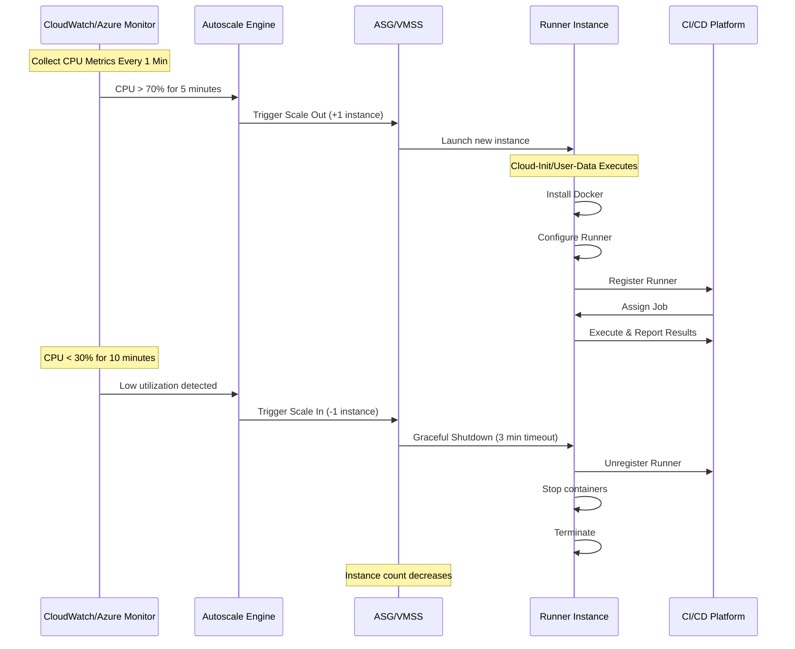

### Autoscale Configuration

#### Azure VMSS Autoscale Rules

```hcl
Scale Out Rule:
- Metric: CPU Percentage
- Threshold: > 70%
- Time Window: 5 minutes
- Time Aggregation: Average
- Action: Increase count by 1
- Cooldown: 3 minutes

Scale In Rule:
- Metric: CPU Percentage
- Threshold: < 30%
- Time Window: 10 minutes (longer for stability)
- Time Aggregation: Average
- Action: Decrease count by 1
- Cooldown: 5 minutes
```

#### AWS Target Tracking Policy

```hcl
Target Tracking:
- Metric: CPU Utilization
- Target: 70% average
- Scale Out: When above target for 2 consecutive periods (2 min)
- Scale In: When below target for 15 consecutive periods (15 min)
- Instance Warmup: 180 seconds
- Cooldown: Not required (target tracking manages this)
```

### Scale-to-Zero Capability

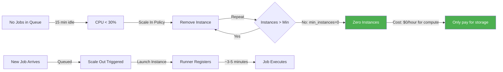

**Benefits**:
- **Cost**: Zero compute cost when idle (only storage: ~$5/mo)
- **Automatic**: No manual intervention required
- **Fast**: Scales up in 3-5 minutes when jobs arrive
- **Safe**: Configurable minimum (0 or higher) based on requirements

---

## Runner Lifecycle

### Runner Registration and Execution Flow

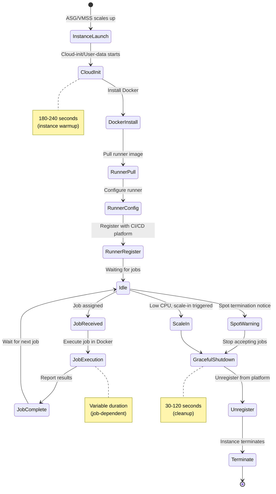

### Runner Container Architecture

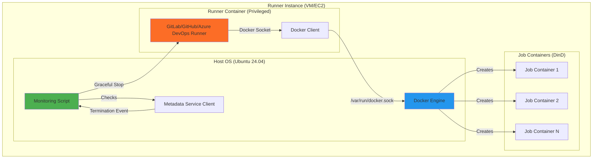

### Multi-Runner Configuration

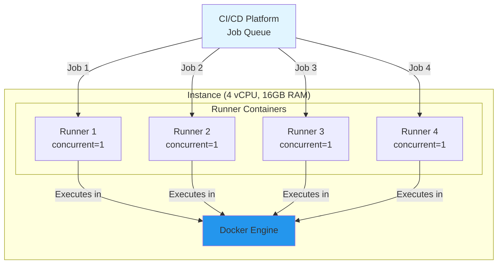

**Runner Count Strategy**:
- **Auto-detect (default)**: `runner_count_per_instance = 0` → Uses vCPU count
- **2 vCPU**: 2 runners (t3.medium, Standard_D2s_v3)
- **4 vCPU**: 4 runners (t3.xlarge, Standard_D4s_v3)
- **8 vCPU**: 8 runners (m5.2xlarge, Standard_D8s_v3)
- **Manual Override**: Set specific count based on workload

---

## Security Architecture

### Security Layers

```mermaid
graph TB
    subgraph "Layer 1: Network Security"
        NSG[Network Security Group/SG<br/>✅ Deny all inbound<br/>✅ Allow outbound to internet]
        PRIVATE[Private Subnet<br/>✅ No public IPs<br/>✅ Internet via NAT]
    end
    
    subgraph "Layer 2: Instance Security"
        SSH[SSH Access<br/>❌ Disabled by default]
        IMDS[Instance Metadata<br/>✅ IMDSv2 required (AWS)<br/>✅ Auth required]
        DISK[Disk Encryption<br/>✅ Enabled by default<br/>✅ Platform-managed keys]
    end
    
    subgraph "Layer 3: Identity & Access"
        IAM[IAM Role/Managed Identity<br/>✅ Least privilege<br/>✅ No stored credentials]
        SECRETS[Secrets Management<br/>✅ Marked sensitive<br/>✅ External stores recommended]
    end
    
    subgraph "Layer 4: Runtime Security"
        DOCKER[Docker Isolation<br/>✅ Container boundaries<br/>⚠️ Privileged for DinD]
        MONITOR[Security Monitoring<br/>✅ CloudWatch/Azure Monitor<br/>✅ Flow logs available]
    end
    
    subgraph "Layer 5: Compliance"
        AUDIT[Audit & Compliance<br/>✅ All actions logged<br/>✅ Immutable infrastructure]
        PATCH[Patching Strategy<br/>✅ Ephemeral instances<br/>✅ Latest OS on launch]
    end
    
    style NSG fill:#ff6b6b
    style SSH fill:#ff6b6b
    style DISK fill:#4caf50
    style IAM fill:#4caf50
    style MONITOR fill:#4caf50
```

### Security Threat Model

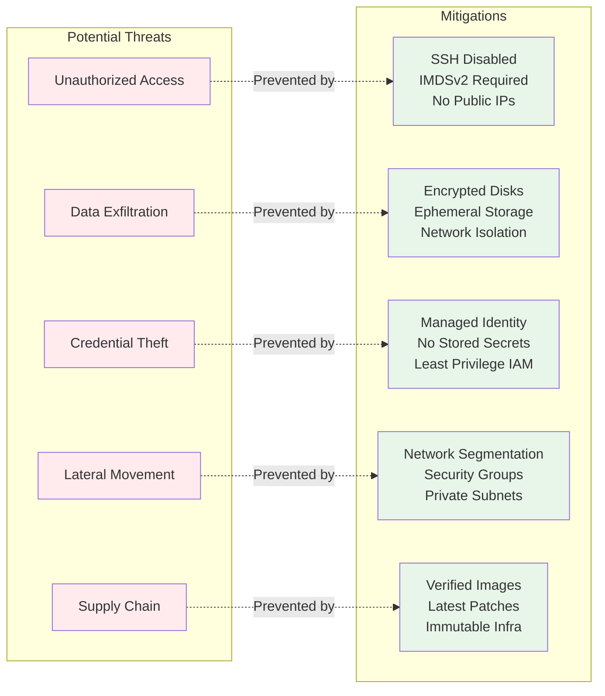

---

## Spot Instance Management

### Spot Termination Handling

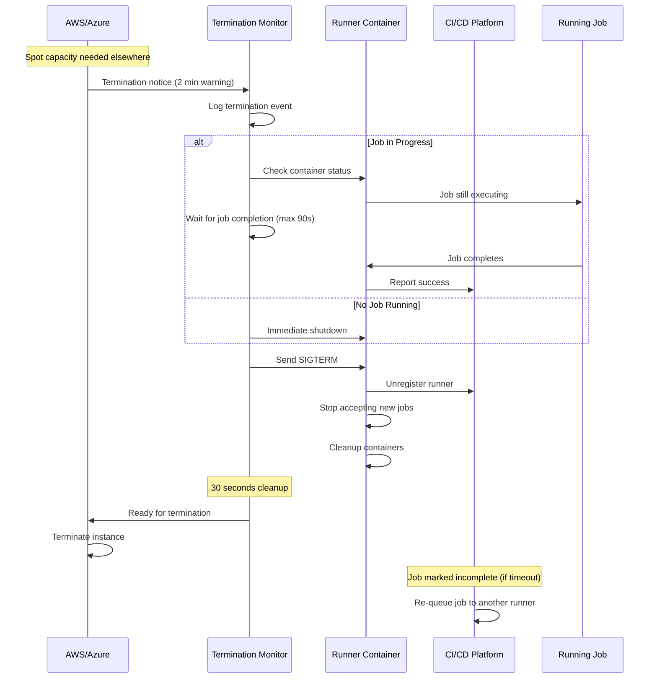

### Spot vs On-Demand Decision Matrix

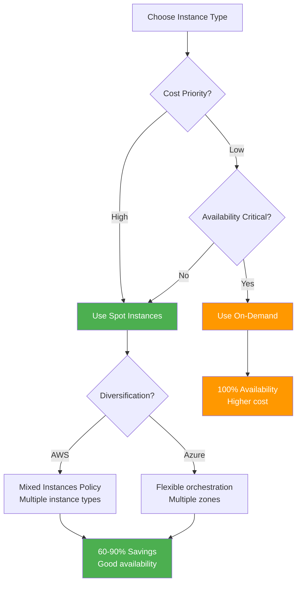

### Spot Instance Availability Strategy

**AWS**:
- **Mixed Instances Policy**: Supports multiple instance types
- **Example**: `["t3.medium", "t3a.medium", "t2.medium", "t3.small"]`
- **Benefit**: If t3.medium spot unavailable, ASG tries t3a.medium, then t2.medium, etc.
- **Result**: Higher spot availability, fewer interruptions

**Azure**:
- **Flexible Orchestration**: Automatically tries different zones
- **Availability Zones**: 1, 2, 3
- **Benefit**: If zone 1 spot unavailable, tries zone 2, then zone 3
- **Result**: Higher spot availability across regions

---

## Multi-Cloud Comparison

### Feature Parity Matrix

| Feature | Azure (VMSS) | AWS (ASG) | Notes |
|---------|-------------|-----------|-------|
| **Autoscaling** | ✅ Azure Monitor | ✅ Target Tracking | Both CPU-based, scale 0-N |
| **Spot Instances** | ✅ Spot Priority | ✅ Spot Instances | 60-90% savings on both |
| **Scale to Zero** | ✅ min=0 | ✅ min=0 | Cost optimization feature |
| **Availability Zones** | ✅ Zones 1,2,3 | ✅ Multi-AZ | High availability on both |
| **Instance Metadata** | ✅ IMDS | ✅ IMDSv2 | Spot termination monitoring |
| **Managed Identity** | ✅ System-Assigned | ✅ IAM Role | No stored credentials |
| **Disk Encryption** | ✅ Platform Keys | ✅ AWS KMS | Enabled by default |
| **Network Isolation** | ✅ NSG + VNet | ✅ SG + VPC | Private by default |
| **SSH Access** | ❌ Disabled | ❌ Disabled | Secure by default |
| **Secure Access** | ✅ Azure Bastion | ✅ Session Manager | No SSH keys needed |
| **Monitoring** | ✅ Azure Monitor | ✅ CloudWatch | Metrics + logs |
| **Cost** | ~$13-31/mo spot | ~$13-31/mo spot | Similar economics |

### Architecture Decision Tree

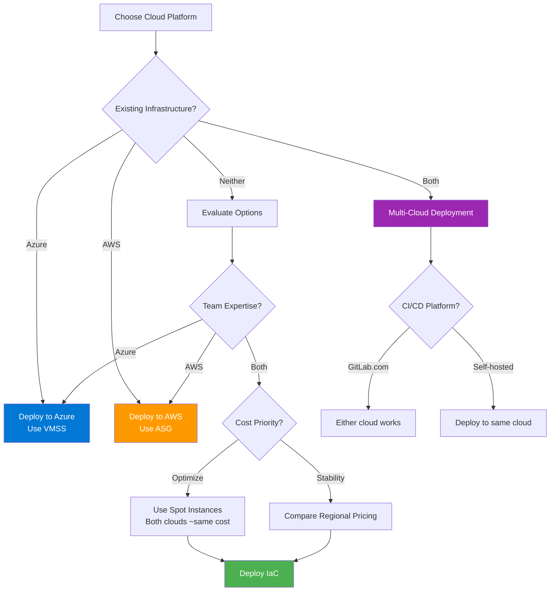

---

## Cost Optimization Features

### Cost Breakdown (Monthly)

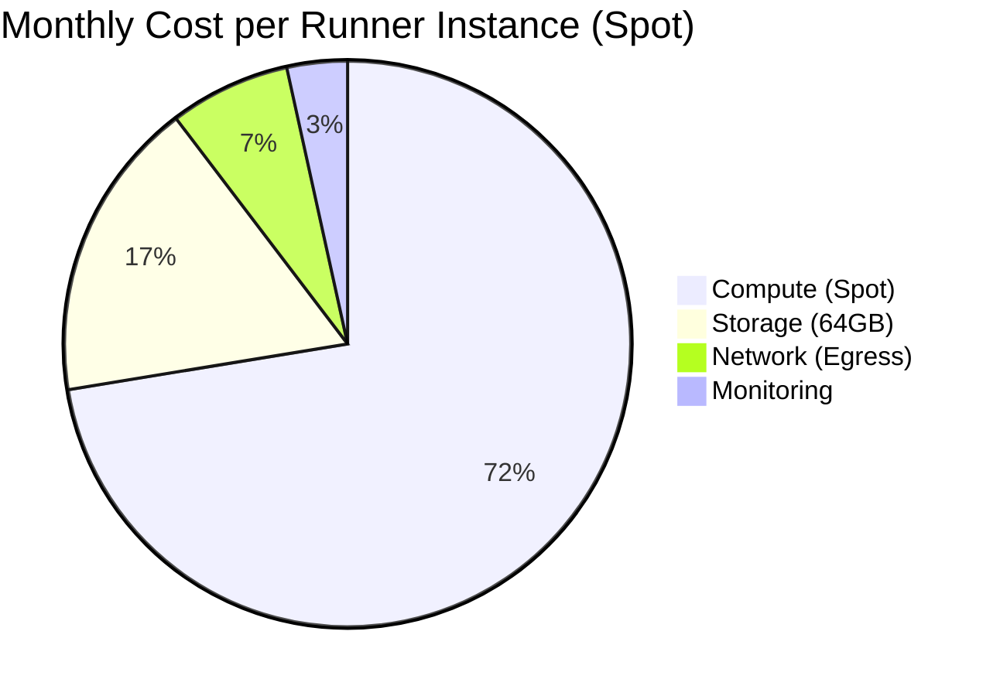

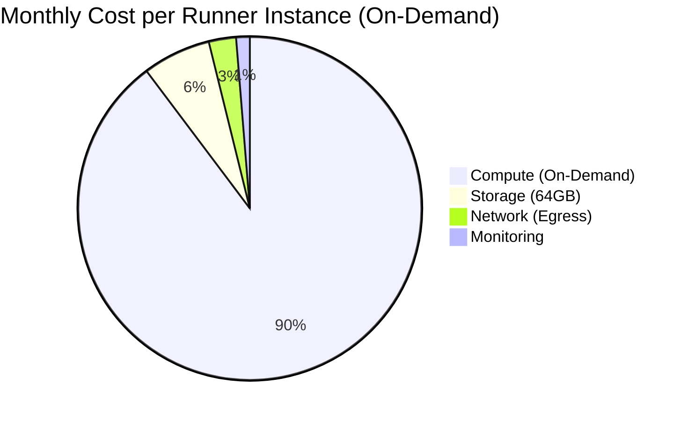

### Cost Optimization Flow

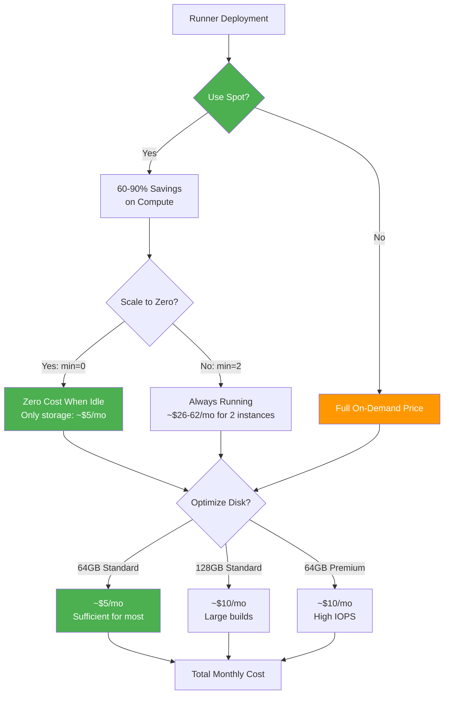

### Cost Comparison Table

| Configuration | Compute/Month | Storage/Month | Total/Month | vs On-Demand |
|---------------|---------------|---------------|-------------|--------------|
| **Spot + Scale-to-Zero** (Recommended) | $0 (idle) | $5 | **$5** (idle) | -95% |
| **Spot + min=1** | $21 | $5 | **$26** | -66% |
| **Spot + min=2** | $42 | $10 | **$52** | -66% |
| **On-Demand + min=1** | $70 | $5 | **$75** | Baseline |
| **On-Demand + min=2** | $140 | $10 | **$150** | Baseline |

**Notes**:
- Costs based on Standard_D2s_v3 (Azure) / t3.medium (AWS)
- Storage: 64GB StandardSSD/gp3
- Network costs not included (typically $1-5/mo)
- Spot pricing varies by region and availability

### Resource Right-Sizing Guide

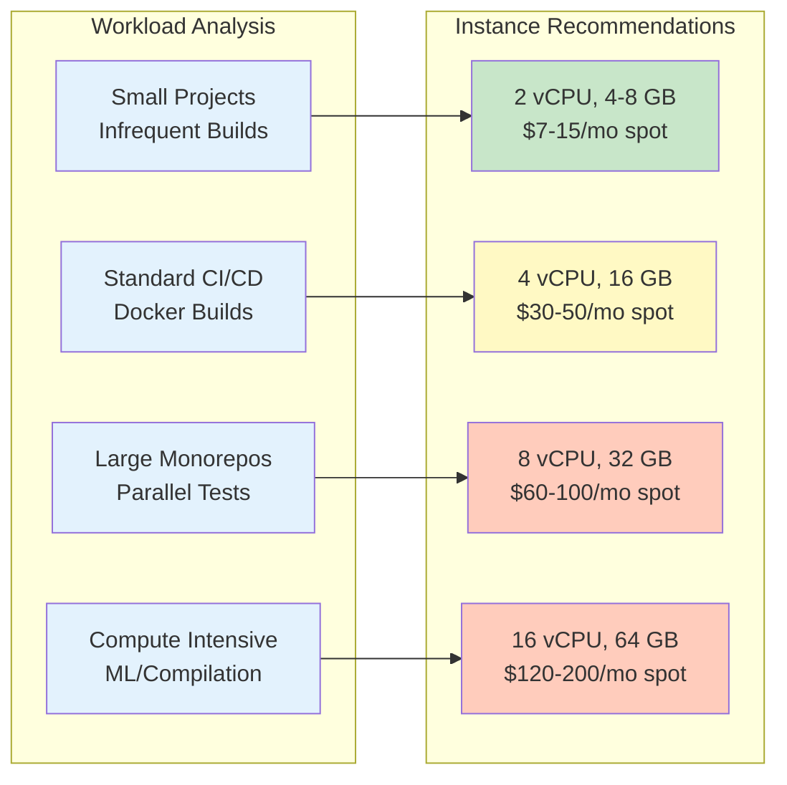

---

## Deployment Options

### Deployment Patterns

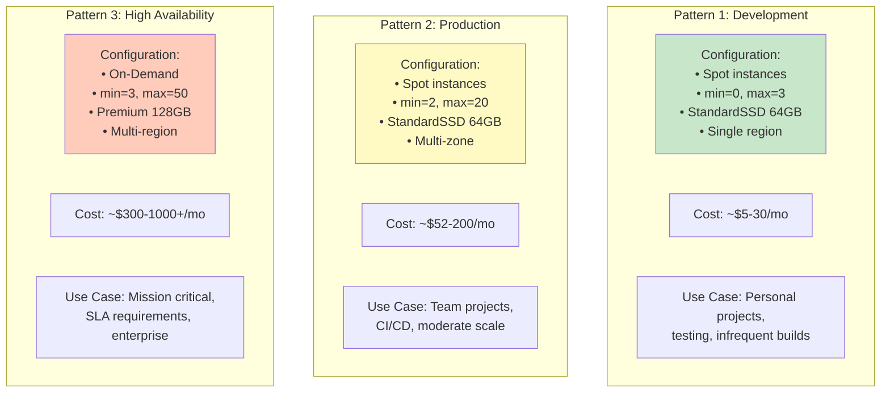

---

## Summary

### Key Architectural Principles

1. **Cost-First Design**
   - Spot instances by default (60-90% savings)
   - Scale-to-zero capability (min_instances = 0)
   - Right-sized defaults (2 vCPU, 64GB disk)
   - Auto-detection of optimal runner count

2. **Security-First Design**
   - SSH disabled by default
   - No public IPs on AWS (private subnets + NAT)
   - IMDSv2 required (AWS)
   - Encrypted disks
   - Managed identities (no stored credentials)

3. **Cloud-Agnostic Patterns**
   - Consistent configuration across Azure and AWS
   - Feature parity between implementations
   - Reusable Terraform modules
   - Same operational patterns

4. **Production-Ready**
   - Comprehensive monitoring
   - Graceful spot termination handling
   - Autoscaling with scale-to-zero
   - Multi-zone high availability
   - Ephemeral and immutable

5. **Developer-Friendly**
   - Simple configuration (minimal required variables)
   - Clear documentation with cost implications
   - Pre-configured security defaults
   - Easy customization for specific needs

### Next Steps

- Review [QUICKSTART.md](QUICKSTART.md) for deployment instructions
- Check [SECURITY.md](SECURITY.md) for security best practices
- See [TESTING_GUIDE.md](TESTING_GUIDE.md) for validation procedures
- Read [TERRAFORM_TESTING.md](docs/TERRAFORM_TESTING.md) for automated tests

---

**Last Updated**: January 2026  
**Version**: 1.1  
**Maintained By**: Infrastructure Team
