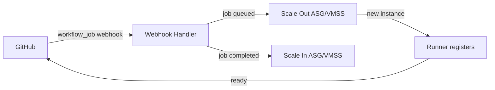

# Production Features Guide

This guide explains the production-ready features available for self-hosted runners and how to enable them.

## Overview

Production features are **optional** but **highly recommended** for production deployments. They provide:

- ⚡ **Faster builds** through distributed caching
- 🔍 **Better troubleshooting** with centralized logging
- 📊 **Operational visibility** through metrics and monitoring
- 🎯 **More responsive scaling** with webhook-based triggers

All features are disabled by default for backward compatibility, but enabling them significantly improves the production experience.

---

## 🗄️ Distributed Caching

### What It Does

Shares cached dependencies (npm packages, Maven artifacts, Docker layers, etc.) between ephemeral runners using cloud storage.

### Why You Need It

Without distributed caching:
- ❌ Every runner downloads dependencies from scratch
- ❌ Builds are 2-5x slower
- ❌ Higher bandwidth costs
- ❌ More load on package registries

With distributed caching:
- ✅ Dependencies cached in cloud storage
- ✅ 2-5x faster builds
- ✅ Reduced bandwidth costs
- ✅ Essential for ephemeral runners

### Configuration

#### Azure (Blob Storage)

```hcl
# Required
enable_distributed_cache     = true
cache_storage_account_name   = "mycompanyrunnercache"  # Must be globally unique

# Optional
cache_type                   = "azurerm"               # Default
cache_shared                 = true                    # Share cache between all runners
cache_storage_container_name = "runner-cache"          # Default
cache_storage_account_key    = ""                      # Leave empty to use Managed Identity
```

**Setup Steps:**

1. Create Storage Account:
```bash
az storage account create \
  --name mycompanyrunnercache \
  --resource-group my-rg \
  --location eastus \
  --sku Standard_LRS
```

2. Create Container:
```bash
az storage container create \
  --name runner-cache \
  --account-name mycompanyrunnercache
```

3. Get Access Key (if not using Managed Identity):
```bash
az storage account keys list \
  --account-name mycompanyrunnercache \
  --query '[0].value' -o tsv
```

#### AWS (S3)

```hcl
# Required
enable_distributed_cache = true
cache_s3_bucket_name     = "my-runner-cache"

# Optional
cache_shared             = true     # Share cache between all runners
cache_s3_region          = "us-east-1"
```

**Setup Steps:**

1. Create S3 Bucket:
```bash
aws s3 mb s3://my-runner-cache --region us-east-1
```

2. Enable versioning (optional but recommended):
```bash
aws s3api put-bucket-versioning \
  --bucket my-runner-cache \
  --versioning-configuration Status=Enabled
```

### Cost Impact

| Storage Size | Azure Blob (LRS) | AWS S3 (Standard) |
|--------------|------------------|-------------------|
| 10 GB | $0.20/month | $0.23/month |
| 50 GB | $1.00/month | $1.15/month |
| 100 GB | $2.00/month | $2.30/month |
| 500 GB | $10.00/month | $11.50/month |

Plus data transfer costs (first 100GB free on Azure, first 1GB free on AWS)

### Performance Impact

**Typical Build Time Improvements:**
- Node.js projects: 2-3x faster
- Java/Maven projects: 3-5x faster
- Docker builds: 2-4x faster
- Python projects: 2-3x faster

---

## 📊 Centralized Logging

### What It Does

Forwards runner logs to Azure Log Analytics or AWS CloudWatch for centralized aggregation, search, and retention.

### Why You Need It

Without centralized logging:
- ❌ Logs lost when ephemeral runners terminate
- ❌ No historical data for troubleshooting
- ❌ Difficult to correlate issues across runners
- ❌ No compliance-ready log retention

With centralized logging:
- ✅ All logs preserved after runner termination
- ✅ Advanced search and filtering
- ✅ Long-term retention for compliance
- ✅ Alerting on log patterns
- ✅ Correlation across runners and jobs

### Configuration

#### Azure (Log Analytics)

```hcl
# Required
enable_centralized_logging  = true
log_analytics_workspace_id  = "/subscriptions/{sub-id}/resourceGroups/{rg}/providers/Microsoft.OperationalInsights/workspaces/{workspace}"
log_analytics_workspace_key = "your-workspace-key"

# Optional
log_retention_days = 30  # 30, 60, 90, 120, 180, or 365
```

**Setup Steps:**

1. Create Log Analytics Workspace:
```bash
az monitor log-analytics workspace create \
  --resource-group my-rg \
  --workspace-name my-runner-logs \
  --location eastus
```

2. Get Workspace ID:
```bash
az monitor log-analytics workspace show \
  --resource-group my-rg \
  --workspace-name my-runner-logs \
  --query id -o tsv
```

3. Get Workspace Key:
```bash
az monitor log-analytics workspace get-shared-keys \
  --resource-group my-rg \
  --workspace-name my-runner-logs \
  --query primarySharedKey -o tsv
```

**Query Logs:**

```kusto
// View all runner logs
GitLabRunner_CL
| where TimeGenerated > ago(24h)
| order by TimeGenerated desc

// Find failed jobs
GitLabRunner_CL
| where Message contains "error" or Message contains "failed"
| order by TimeGenerated desc

// Runner startup issues
GitLabRunner_CL
| where Message contains "registration" or Message contains "startup"
| order by TimeGenerated desc
```

#### AWS (CloudWatch)

```hcl
# Required
enable_centralized_logging = true
cloudwatch_log_group_name  = "/aws/runners/gitlab"

# Optional
log_retention_days = 30  # 1, 3, 5, 7, 14, 30, 60, 90, 120, 150, 180, 365, 400, 545, 731, 1827, 3653
```

**Setup Steps:**

1. Create Log Group:
```bash
aws logs create-log-group \
  --log-group-name /aws/runners/gitlab
```

2. Set Retention:
```bash
aws logs put-retention-policy \
  --log-group-name /aws/runners/gitlab \
  --retention-in-days 30
```

**Query Logs:**

```bash
# View recent logs
aws logs tail /aws/runners/gitlab --follow

# Search for errors
aws logs filter-log-events \
  --log-group-name /aws/runners/gitlab \
  --filter-pattern "error"

# Get logs from specific time range
aws logs filter-log-events \
  --log-group-name /aws/runners/gitlab \
  --start-time $(date -d '1 hour ago' +%s)000
```

### Cost Impact

#### Azure Log Analytics

| Ingestion | Storage (30 days) | Monthly Cost |
|-----------|-------------------|--------------|
| 1 GB | 1 GB | ~$2.76 |
| 5 GB | 5 GB | ~$13.80 |
| 10 GB | 10 GB | ~$27.60 |
| 50 GB | 50 GB | ~$138.00 |

- Ingestion: $2.76/GB
- Retention (30 days): Included
- Retention (90 days): +$0.12/GB/month
- Retention (365 days): +$0.05/GB/month

#### AWS CloudWatch

| Ingestion | Storage (30 days) | Monthly Cost |
|-----------|-------------------|--------------|
| 1 GB | 1 GB | ~$0.53 |
| 5 GB | 5 GB | ~$2.65 |
| 10 GB | 10 GB | ~$5.30 |
| 50 GB | 50 GB | ~$26.50 |

- Ingestion: $0.50/GB
- Storage: $0.03/GB/month

### Log Volume Estimates

Typical daily log volume per runner:
- Light usage (1-5 jobs/day): ~100-500 MB/day
- Medium usage (10-20 jobs/day): ~500 MB-2 GB/day
- Heavy usage (50+ jobs/day): ~2-5 GB/day

---

## 📈 Runner Monitoring

### What It Does

Exposes Prometheus-compatible metrics endpoint for monitoring runner health, performance, and job execution.

### Why You Need It

Without monitoring:
- ❌ No visibility into runner performance
- ❌ Cannot detect capacity issues proactively
- ❌ Difficult to optimize runner configuration
- ❌ No alerting on runner failures

With monitoring:
- ✅ Real-time runner health metrics
- ✅ Track job duration and success rate
- ✅ Monitor autoscaling behavior
- ✅ Proactive alerting
- ✅ Capacity planning insights

### Configuration

```hcl
enable_runner_monitoring = true
metrics_port             = 9252  # Default GitLab Runner metrics port
```

### Key Metrics

#### GitLab Runner Metrics

```
# Job metrics
gitlab_runner_jobs                           # Currently executing jobs
gitlab_runner_job_duration_seconds           # Job execution time
gitlab_runner_jobs_total                     # Total jobs executed

# Runner state
gitlab_runner_concurrent                     # Max concurrent jobs
gitlab_runner_limit                          # Runner limit

# API requests
gitlab_runner_api_request_statuses_total     # API request status codes

# Errors
gitlab_runner_errors_total                   # Error count by severity
```

#### GitHub Actions Runner Metrics

```
# Job metrics
github_runner_jobs_running                   # Currently running jobs
github_runner_job_duration_seconds           # Job duration
github_runner_jobs_completed_total           # Completed jobs

# Runner state
github_runner_state                          # Runner status (idle, busy)
github_runner_api_calls_total                # API calls made
```

#### Azure DevOps Agent Metrics

```
# Job metrics
azdo_agent_jobs_running                      # Running jobs
azdo_agent_job_duration_seconds              # Job duration
azdo_agent_jobs_completed_total              # Completed jobs

# Agent state
azdo_agent_state                             # Agent status
azdo_agent_capabilities                      # Agent capabilities
```

### Integration with Monitoring Tools

#### Prometheus

**prometheus.yml:**
```yaml
scrape_configs:
  - job_name: 'gitlab-runners'
    static_configs:
      - targets:
        - 'runner-1.example.com:9252'
        - 'runner-2.example.com:9252'
    
    # Or use Azure/AWS service discovery
    azure_sd_configs:
      - subscription_id: 'your-sub-id'
        resource_group: 'your-rg'
        port: 9252
```

#### Grafana

Import community dashboards:
- GitLab Runner: Dashboard ID 13802
- GitHub Actions: Dashboard ID 14835
- Azure DevOps: Dashboard ID 15234

Or create custom dashboards:
```json
{
  "panels": [
    {
      "title": "Active Jobs",
      "targets": [
        {
          "expr": "sum(gitlab_runner_jobs{state=\"running\"})"
        }
      ]
    },
    {
      "title": "Job Success Rate",
      "targets": [
        {
          "expr": "rate(gitlab_runner_jobs_total{status=\"success\"}[5m]) / rate(gitlab_runner_jobs_total[5m]) * 100"
        }
      ]
    }
  ]
}
```

#### Azure Monitor

Metrics are automatically sent to Azure Monitor when runners are deployed on Azure VMs.

**View in Azure Portal:**
1. Navigate to Virtual Machine Scale Set
2. Select "Metrics" from left menu
3. Add metrics: CPU, Memory, Disk, Network
4. Create alerts based on thresholds

#### CloudWatch

For AWS deployments, configure CloudWatch agent to scrape Prometheus metrics:

**cloudwatch-config.json:**
```json
{
  "metrics": {
    "namespace": "GitLabRunner",
    "metrics_collected": {
      "prometheus": {
        "prometheus_config_path": "/etc/prometheus/prometheus.yml",
        "emf_processor": {
          "metric_declaration": [
            {
              "source_labels": ["job"],
              "label_matcher": "^gitlab-runners$",
              "dimensions": [["runner"]],
              "metric_selectors": [
                "^gitlab_runner_jobs$",
                "^gitlab_runner_job_duration_seconds$"
              ]
            }
          ]
        }
      }
    }
  }
}
```

### Alerting Examples

#### Prometheus Alertmanager

**alerts.yml:**
```yaml
groups:
  - name: runner_alerts
    rules:
      - alert: RunnerDown
        expr: up{job="gitlab-runners"} == 0
        for: 5m
        annotations:
          summary: "Runner {{ $labels.instance }} is down"
      
      - alert: HighJobFailureRate
        expr: |
          rate(gitlab_runner_jobs_total{status="failed"}[15m]) /
          rate(gitlab_runner_jobs_total[15m]) > 0.2
        for: 10m
        annotations:
          summary: "High job failure rate (>20%)"
      
      - alert: RunnerQueueBuilding
        expr: gitlab_runner_jobs{state="queued"} > 10
        for: 10m
        annotations:
          summary: "Job queue building up ({{ $value }} jobs queued)"
```

### Cost Impact

**Minimal** - Metrics collection uses existing infrastructure:
- **Azure**: Free (included in Azure Monitor)
- **AWS**: Free (metrics stored in memory on runners)
- **Prometheus**: Self-hosted, storage costs only (~$5-20/month for 10-50 runners)

---

## ⚡ Webhook-Based Scaling (GitHub Actions)

### What It Does

Scales runners immediately in response to GitHub workflow job events instead of reactive CPU-based scaling.

### Why You Need It

Without webhook scaling (CPU-based only):
- ❌ 5-10 minute delay for runners to spin up
- ❌ Jobs wait in queue during scale-up
- ❌ Inefficient resource utilization
- ❌ Cannot scale to zero reliably

With webhook scaling:
- ✅ Instant response to job queue (< 1 minute)
- ✅ Scale up before jobs even start
- ✅ More efficient resource utilization
- ✅ Reliable scale-to-zero

### How It Works



### Configuration

```hcl
# GitHub runner only
enable_webhook_scaling = true
webhook_secret         = "your-secret-key-here"  # Generate with: openssl rand -hex 32
webhook_port           = 8080
```

### Setup Steps

#### 1. Deploy Infrastructure with Webhook Support

```bash
cd github-runner/azure  # or aws

# Add to terraform.tfvars
cat >> terraform.tfvars << EOF
enable_webhook_scaling = true
webhook_secret         = "$(openssl rand -hex 32)"
EOF

terraform apply
```

#### 2. Configure GitHub Webhook

**Repository Webhook:**

1. Go to Repository → Settings → Webhooks → Add webhook
2. Payload URL: `https://your-webhook-endpoint/webhook`
3. Content type: `application/json`
4. Secret: (use the webhook_secret from terraform.tfvars)
5. Events: Select "Workflow jobs"
6. Active: ✅ Checked

**Organization Webhook:**

1. Go to Organization → Settings → Webhooks → Add webhook
2. Same configuration as repository webhook
3. Events: Select "Workflow jobs"

#### 3. Test Webhook

Trigger a workflow and check:

```bash
# View webhook deliveries in GitHub
# Repository → Settings → Webhooks → Recent Deliveries

# Check webhook handler logs (Azure)
az monitor log-analytics query \
  --workspace your-workspace-id \
  --analytics-query "WebhookHandler_CL | order by TimeGenerated desc | take 50"

# Check webhook handler logs (AWS)
aws logs tail /aws/runners/webhook --follow
```

### Required IAM Permissions

#### Azure

The webhook handler needs permissions to scale the VMSS:

```json
{
  "permissions": [
    {
      "actions": [
        "Microsoft.Compute/virtualMachineScaleSets/read",
        "Microsoft.Compute/virtualMachineScaleSets/write"
      ],
      "notActions": [],
      "dataActions": [],
      "notDataActions": []
    }
  ]
}
```

Apply via:
```bash
az role assignment create \
  --assignee <webhook-identity> \
  --role "Virtual Machine Contributor" \
  --scope "/subscriptions/{sub}/resourceGroups/{rg}/providers/Microsoft.Compute/virtualMachineScaleSets/{vmss}"
```

#### AWS

The webhook handler Lambda needs:

```json
{
  "Version": "2012-10-17",
  "Statement": [
    {
      "Effect": "Allow",
      "Action": [
        "autoscaling:DescribeAutoScalingGroups",
        "autoscaling:SetDesiredCapacity",
        "autoscaling:UpdateAutoScalingGroup"
      ],
      "Resource": "arn:aws:autoscaling:*:*:autoScalingGroup:*:autoScalingGroupName/github-runner-*"
    }
  ]
}
```

### Scaling Logic

**Scale Out (Job Queued):**
```
desired_capacity = current_running_jobs + queued_jobs + standby_count
desired_capacity = min(desired_capacity, max_instances)
```

**Scale In (Job Completed):**
```
if idle_runners > standby_count:
    desired_capacity = current_capacity - 1
    desired_capacity = max(desired_capacity, min_instances)
```

### Cost Impact

**Minimal** - Webhook handler uses:
- **Azure**: Azure Functions Consumption Plan (~$0.20/month for 1M requests)
- **AWS**: Lambda Free Tier covers most usage (~$0.20/month for 1M requests)

### Performance Impact

**Webhook Scaling:**
- Scale-out latency: ~30-60 seconds (vs 5-10 minutes with CPU-based)
- More predictable scaling behavior
- Better resource utilization

---

## Production Deployment Checklist

Before deploying to production, ensure:

### Pre-Deployment

- [ ] **Distributed Caching**
  - [ ] Storage account/bucket created
  - [ ] Access credentials configured
  - [ ] `cache_shared = true` for team-wide caching

- [ ] **Centralized Logging**
  - [ ] Log Analytics workspace / CloudWatch log group created
  - [ ] Retention period set appropriately (30+ days)
  - [ ] Log queries tested

- [ ] **Runner Monitoring**
  - [ ] Metrics port accessible (9252)
  - [ ] Prometheus/Grafana configured
  - [ ] Alerting rules defined

- [ ] **Webhook Scaling** (GitHub only)
  - [ ] Webhook secret generated
  - [ ] GitHub webhook configured
  - [ ] IAM permissions granted

### Post-Deployment

- [ ] **Verify Caching**
  ```bash
  # Azure
  az storage blob list --account-name myaccount --container runner-cache
  
  # AWS
  aws s3 ls s3://my-runner-cache/
  ```

- [ ] **Verify Logging**
  ```bash
  # Azure
  az monitor log-analytics query --workspace <id> --analytics-query "GitLabRunner_CL | take 10"
  
  # AWS
  aws logs tail /aws/runners/gitlab
  ```

- [ ] **Verify Monitoring**
  ```bash
  curl http://runner-ip:9252/metrics
  ```

- [ ] **Verify Webhook** (GitHub)
  - Trigger test workflow
  - Check webhook deliveries in GitHub
  - Verify scale-out occurs

### Ongoing Operations

- [ ] **Monitor Costs**
  - Review storage costs (caching)
  - Review log ingestion costs
  - Set up cost alerts

- [ ] **Tune Autoscaling**
  - Adjust min/max instances based on usage
  - Tune CPU thresholds
  - Monitor queue depth

- [ ] **Review Alerts**
  - Check for runner failures
  - Monitor job success rate
  - Review scaling events

- [ ] **Cache Management**
  - Set lifecycle policies for old cache
  - Monitor cache size
  - Clean up unused cache periodically

---

## Troubleshooting

### Caching Issues

**Problem:** Builds still slow, cache not working

**Solutions:**
```bash
# Verify cache backend is accessible
# Azure
az storage blob list --account-name myaccount --container runner-cache

# AWS
aws s3 ls s3://my-runner-cache/

# Check runner logs for cache errors
grep -i "cache" /var/log/gitlab-runner-init.log

# Verify cache configuration in runner config
cat /etc/gitlab-runner/config.toml | grep -A 5 cache
```

### Logging Issues

**Problem:** No logs appearing in Log Analytics / CloudWatch

**Solutions:**
```bash
# Azure - Check OMS agent status
sudo /opt/microsoft/omsagent/bin/service_control status

# Azure - Verify workspace connection
sudo /opt/microsoft/omsagent/bin/omsadmin.sh -l

# AWS - Check CloudWatch agent status
sudo systemctl status amazon-cloudwatch-agent

# AWS - View agent logs
sudo tail -f /opt/aws/amazon-cloudwatch-agent/logs/amazon-cloudwatch-agent.log
```

### Monitoring Issues

**Problem:** Metrics not being scraped

**Solutions:**
```bash
# Test metrics endpoint
curl http://localhost:9252/metrics

# Check firewall rules
# Azure
az network nsg rule list --nsg-name runner-nsg --resource-group my-rg

# AWS
aws ec2 describe-security-groups --group-ids sg-xxx

# Verify Prometheus configuration
curl http://prometheus:9090/targets
```

### Webhook Issues

**Problem:** Webhook not triggering scaling

**Solutions:**
```bash
# Check webhook deliveries in GitHub
# Repository → Settings → Webhooks → Recent Deliveries

# View webhook handler logs
# Azure
az monitor log-analytics query --workspace <id> --analytics-query "WebhookHandler_CL | take 20"

# AWS
aws logs tail /aws/runners/webhook --follow

# Verify webhook secret matches
echo -n "webhook-payload" | openssl dgst -sha256 -hmac "your-secret"

# Check IAM permissions
# Azure
az role assignment list --assignee <webhook-identity>

# AWS
aws iam get-role-policy --role-name webhook-handler --policy-name webhook-policy
```

---

## Cost Summary

Typical monthly costs for production deployment (10 runners, 20 jobs/day each):

| Feature | Azure | AWS | Notes |
|---------|-------|-----|-------|
| **Base Infrastructure** | $150-300 | $150-300 | VMSS/ASG + spot instances |
| **Distributed Caching** | $5-15 | $6-18 | 200-500 GB cache |
| **Centralized Logging** | $10-30 | $5-15 | 10-30 GB/month logs |
| **Runner Monitoring** | $0 | $0 | Included in infrastructure |
| **Webhook Scaling** | $0.20 | $0.20 | Functions/Lambda |
| **Total** | **$165-345** | **$161-333** | |

**Cost Optimization Tips:**
- Use lifecycle policies to expire old cache (30-90 days)
- Reduce log retention period if compliance allows
- Use spot instances (already default)
- Scale to zero during off-hours

---

## Next Steps

1. **Start with Distributed Caching** - Biggest immediate impact on build speed
2. **Add Centralized Logging** - Essential for troubleshooting
3. **Enable Monitoring** - Gain visibility into runner performance
4. **Configure Webhook Scaling** - Optimize scaling response time (GitHub only)

For implementation details, see the updated production examples:
- `examples/production/azure-gitlab.tfvars`
- `examples/production/aws-github.tfvars`
- `examples/production/azure-azdo.tfvars`

For questions or issues, please see:
- [TROUBLESHOOTING.md](TROUBLESHOOTING.md)
- [GitHub Issues](https://github.com/fok666/selfhosted-devops/issues)
